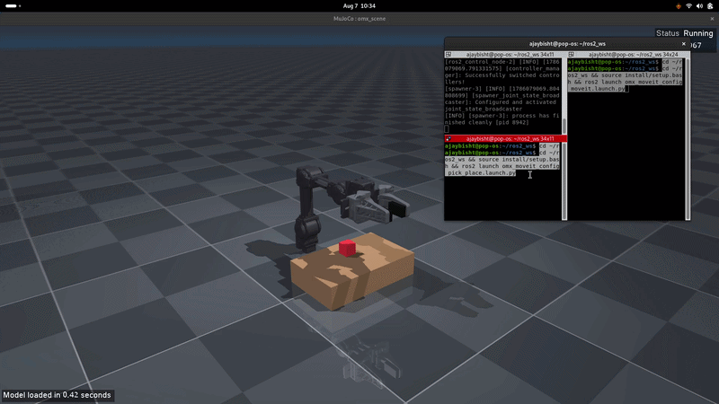
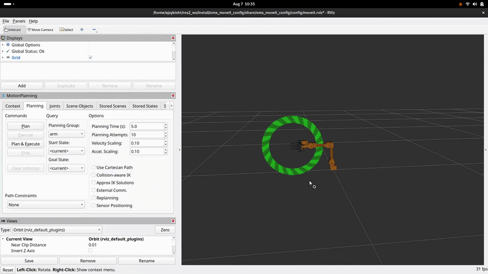

# OpenMANIPULATOR-X — Vision-Driven Pick-and-Place

A full perception-to-motion pipeline built on the ROBOTIS OpenMANIPULATOR-X 4-DOF robotic arm, simulated in MuJoCo and controlled through ROS 2 and MoveIt 2. An overhead camera detects colored objects on the table using OpenCV and the arm picks and places each into its matching color zone — fully autonomously, with randomized object colors and positions on every launch.

---

## Demo

### MuJoCo Simulation


### RViz — Robot Model & TF Tree


### Pick-and-Place with OpenCV Detection
> *Add a GIF of the full vision-driven sort here — arm parking, camera detecting, then picking and placing all three objects*

---

## Overview

This project started as a ROS 2 URDF modeling assignment and grew into a complete perception-planning-control loop. The OpenMANIPULATOR-X is simulated using its real STL meshes in MuJoCo, bridged to ROS 2 via `mujoco_ros2_control`, and planned with MoveIt 2. An overhead camera mounted above the workspace publishes a live image feed over ROS. An OpenCV pipeline detects each object's color and computes its real-world position through pixel-to-world back-projection. A pure NumPy IK solver turns the detected position into grasp joint angles — so the arm goes to wherever the object actually is, not a hardcoded spot.

On every launch, the three objects (red cube, green cylinder, blue hexagon) are assigned random colors and positions. The system detects them, picks each one, and places it into its matching color zone.

---

## Features

- Real OpenMANIPULATOR-X STL meshes in MuJoCo physics simulation
- `mujoco_ros2_control` bridge — MoveIt plans execute directly in MuJoCo
- MoveIt 2 with OMPL for collision-free motion planning
- Physics-based gripper grasp — no fake object attachment
- Overhead RGB camera publishing over ROS (`/overhead/color/image_raw`)
- OpenCV HSV color detection → pixel-to-world back-projection → detected object position
- Pure NumPy forward and inverse kinematics, verified against MuJoCo to sub-millimetre accuracy
- Scene randomizer — colors and positions shuffled on every launch for a real perception test
- RViz integration for live TF tree and motion planning visualization

---

## Stack

| Tool | Version |
|---|---|
| OS | Pop!_OS 24.04 |
| ROS 2 | Jazzy |
| MuJoCo | 3.x |
| MoveIt 2 | Jazzy |
| mujoco_ros2_control | Jazzy (apt) |
| OpenCV | 4.x |
| Python | 3.x |

---

## Setup

### Prerequisites

```bash
sudo apt install \
  ros-jazzy-mujoco-ros2-control \
  ros-jazzy-mujoco-ros2-control-demos \
  ros-jazzy-moveit \
  ros-jazzy-cv-bridge \
  python3-opencv
```

### Build

```bash
cd ~/omx_project
colcon build
source install/setup.bash
```

---

## How to Run

Open three terminals. In each one, source the workspace first:

```bash
cd ~/omx_project && source install/setup.bash
```

**Terminal 1 — Robot simulation (MuJoCo + controllers + camera):**
```bash
ros2 launch omx_mujoco sim.launch.py
```
Wait until the MuJoCo window shows the arm, table, three colored objects, and three drop zones. Each launch randomizes the object colors and positions automatically.

**Terminal 2 — Vision-driven sorting:**
```bash
ros2 launch omx_moveit_config pick_place.launch.py
```
The arm parks clear of the camera, grabs one overhead frame, detects each object's color and position, then picks and places each into its matching color zone.

**Terminal 3 (optional) — RViz + move_group:**
```bash
ros2 launch omx_moveit_config moveit.launch.py
```

### Verify the camera is publishing
```bash
ros2 topic list | grep overhead
ros2 topic hz /overhead/color/image_raw
```

---

## How It Works

### 1. Scene Randomization
On every `sim.launch.py`, the three objects are assigned a shuffled set of red/green/blue colors and random positions drawn from 15 pre-verified reachable spots on the table, always at least 5 cm apart.

### 2. Vision Detection
The arm parks at a pose clear of the overhead camera. One frame is captured from `/overhead/color/image_raw`. OpenCV HSV thresholding isolates each color, contour analysis finds the object center in pixels, and pixel-to-world back-projection maps it to a real-world (x, y) table coordinate.

### 3. Inverse Kinematics
A pure NumPy damped least-squares IK solver (verified against MuJoCo FK to sub-millimetre accuracy) computes the grasp joint angles for any detected (x, y) position, with a fixed 68° downward wrist angle.

### 4. Pick and Place
MoveIt 2 plans and executes each step — pre-grasp → grasp → close gripper → lift → carry → place → release → retreat — using the IK-computed joint poses. The gripper grasp is handled by MuJoCo contact and friction physics.

---
